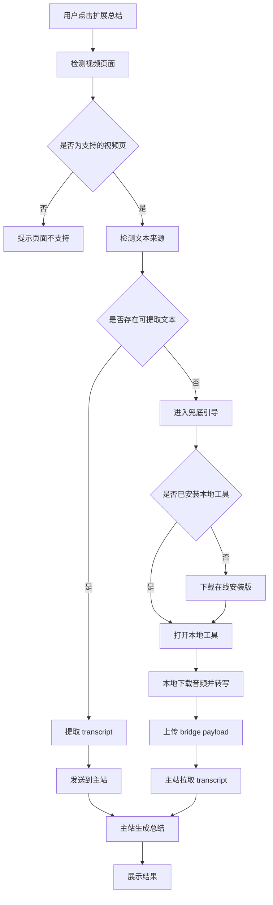
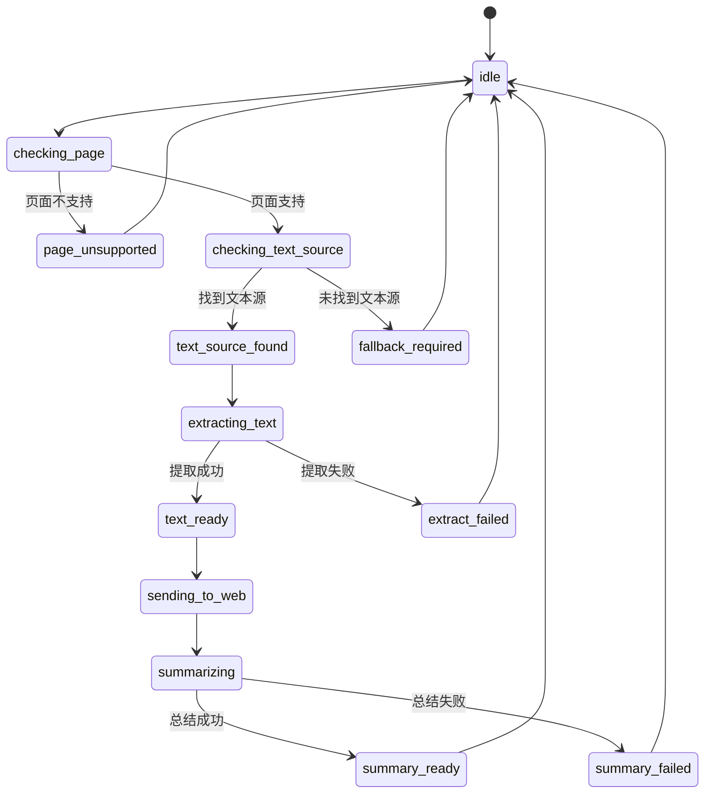

# YouTubeSummarizer 执行型 PRD

## 1. 文档目标

这份文档不是产品宣传稿，而是研发执行稿。

要解决 5 个具体问题：

1. 扩展什么时候应该直接总结。
2. 扩展什么时候应该引导用户去本地工具。
3. 扩展、主站、bridge、本地工具之间到底传什么数据。
4. 失败时用户应该看到什么提示。
5. 后续开发应该按什么顺序推进。

---

## 2. 一句话定义

**YouTubeSummarizer 是一个“优先直取文本、无文本时再本地转写”的视频总结系统。**

更具体一点：

- 浏览器扩展是主入口。
- 主站是统一结果层。
- 本地工具是兜底转写器。
- bridge 是本地工具回传 transcript 的桥接层。

---

## 3. 产品边界

### 3.1 扩展负责什么

- 识别当前是否为可处理的视频页面。
- 判断页面上是否存在可直接提取的文本来源。
- 提取字幕或转写文稿。
- 将 transcript 送往主站并触发总结。
- 在无文本时引导用户使用本地转写助手。

### 3.2 扩展不负责什么

- 不负责本地 Whisper 转写。
- 不负责下载模型、ffmpeg 或运行包。
- 不负责长时间后台任务。

### 3.3 主站负责什么

- 接收 transcript。
- 生成总结。
- 展示 transcript、总结结果和来源信息。
- 拉取本地工具上传的 bridge payload。

### 3.4 本地工具负责什么

- 下载视频音频。
- 执行本地转写。
- 将 transcript 上传到 bridge 或保存到本地。
- 成功后打开主站继续总结。

### 3.5 本地工具不负责什么

- 不做默认入口。
- 不要求普通用户理解复杂参数。
- 不替代主站做结果展示。

---

## 4. 用户场景

### 4.1 场景 A：有字幕

- 用户打开视频，点击扩展。
- 扩展检测到字幕可提取。
- 扩展提取字幕文本。
- 主站生成总结。

### 4.2 场景 B：有转写文稿

- 用户点击扩展。
- 扩展检测到转写文稿。
- 扩展提取转写文本。
- 主站生成总结。

### 4.3 场景 C：字幕和转写文稿都有

- 扩展按优先级选择更稳定、更完整的文本源。
- 直接生成总结。

### 4.4 场景 D：无字幕、无转写文稿

- 扩展无法提取文本。
- 扩展引导下载或打开本地工具。
- 本地工具执行转写。
- 转写结果回传主站。
- 主站继续生成总结。

### 4.5 场景 E：受限视频

- 视频需要登录、地区限制或年龄验证。
- 扩展或本地工具可能尝试读取浏览器 cookies。
- 若仍失败，必须明确提示失败原因。

---

## 5. 主流程



---

## 6. 扩展状态机

## 6.1 状态定义

- `idle`
- `checking_page`
- `checking_text_source`
- `text_source_found`
- `extracting_text`
- `text_ready`
- `sending_to_web`
- `summarizing`
- `summary_ready`
- `fallback_required`
- `page_unsupported`
- `extract_failed`
- `summary_failed`

## 6.2 状态说明

### `idle`

- 初始状态。
- 用户还未点击总结，或任务已结束。

### `checking_page`

- 检查当前页面是否是支持的视频页面。

### `checking_text_source`

- 检查字幕、转写文稿或其他可直接提取文本是否存在。

### `text_source_found`

- 已确认存在可提取文本，但尚未真正提取。

### `extracting_text`

- 正在提取 transcript。

### `text_ready`

- transcript 已经拿到，可以发送给主站。

### `sending_to_web`

- 正在把 transcript 传给主站或主站桥接入口。

### `summarizing`

- 主站正在生成总结。

### `summary_ready`

- 总结成功。

### `fallback_required`

- 确认页面上没有可提取文本。
- 只有这个状态才应该提示“请使用本地转写助手”。

### `page_unsupported`

- 当前不是支持的视频页，或页面结构无法识别。
- 这不是“去装本地工具”的理由。

### `extract_failed`

- 明明存在文本来源，但扩展提取失败。
- 这通常是扩展实现问题或页面结构变化。
- 不能直接把这种错误伪装成“视频无文本”。

### `summary_failed`

- transcript 已拿到，但主站总结失败。
- 用户应允许重试，不应该被引导去重新转写。

## 6.3 状态流转规则



## 6.4 最关键的判定规则

必须明确：

- `fallback_required` 只在“文本源不存在”时出现。
- `extract_failed` 绝不等于 `fallback_required`。
- `summary_failed` 绝不等于 `fallback_required`。

否则会出现严重产品误导：

- 用户其实遇到的是扩展 bug。
- 系统却骗用户去安装本地工具。

这会直接损害信任。

---

## 7. 文本来源判定规则

## 7.1 判定结果结构

扩展在页面检测后，统一输出：

```json
{
  "hasText": true,
  "sourceType": "subtitle",
  "confidence": 0.95,
  "reason": "subtitle_panel_available",
  "canFallbackToLocal": false
}
```

## 7.2 字段说明

- `hasText`
  - 是否存在可提取文本。
- `sourceType`
  - `subtitle`
  - `transcript`
  - `subtitle_and_transcript`
  - `none`
- `confidence`
  - 供日志和调试使用，不直接暴露给普通用户。
- `reason`
  - 内部诊断原因。
- `canFallbackToLocal`
  - 是否应展示本地工具引导。

## 7.3 规则

- 若能明确提取字幕：`hasText = true`
- 若能明确提取转写文稿：`hasText = true`
- 若两者都存在：`hasText = true`
- 若页面支持但检测不到任何文本源：`hasText = false`
- 若页面结构无法识别：不要立刻判定 `none`
- 若脚本异常：不要立刻判定 `none`

---

## 8. 数据协议设计

## 8.1 设计原则

- 不要让扩展、本地工具、bridge、主站各传各的野生字段。
- 必须定义统一的 Transcript Envelope。
- bridge payload 应基于统一 Envelope，而不是只传裸文本。

## 8.2 Transcript Envelope

```json
{
  "schemaVersion": "1.0",
  "requestId": "req_123456",
  "source": {
    "kind": "extension",
    "sourceType": "subtitle",
    "toolVersion": "extension-0.1.0"
  },
  "video": {
    "platform": "youtube",
    "videoId": "abc123",
    "url": "https://www.youtube.com/watch?v=abc123",
    "title": "Demo Video",
    "channelName": "Demo Channel"
  },
  "transcript": {
    "language": "en",
    "text": "full transcript content",
    "segments": [],
    "charCount": 10240
  },
  "diagnostics": {
    "textSourceReason": "subtitle_panel_available",
    "fallbackUsed": false
  },
  "createdAt": "2026-04-23T15:00:00Z"
}
```

## 8.3 字段说明

### `schemaVersion`

- 协议版本。
- 后续变更时必须可兼容升级。

### `requestId`

- 本次处理链路的统一请求 ID。
- 方便扩展、bridge、主站、本地工具串日志。

### `source`

- `kind`
  - `extension`
  - `local_tool`
  - `manual_paste`
- `sourceType`
  - `subtitle`
  - `transcript`
  - `local_asr`
- `toolVersion`
  - 便于排查版本问题。

### `video`

- 视频元信息。
- 主站展示和日志都依赖这部分。

### `transcript`

- `language`
  - 主要语言。
- `text`
  - 完整文本。
- `segments`
  - 可选，用于未来时间轴能力。
- `charCount`
  - 便于做大小限制和调试。

### `diagnostics`

- 面向研发和排错。
- 普通用户不直接看到。

## 8.4 Bridge Payload

bridge 层建议结构：

```json
{
  "payloadId": "payload_123",
  "envelope": {
    "schemaVersion": "1.0",
    "requestId": "req_123456",
    "source": {
      "kind": "local_tool",
      "sourceType": "local_asr",
      "toolVersion": "local-helper-0.1.0"
    },
    "video": {
      "platform": "youtube",
      "videoId": "abc123",
      "url": "https://www.youtube.com/watch?v=abc123",
      "title": "Demo Video"
    },
    "transcript": {
      "language": "zh",
      "text": "full transcript content",
      "segments": [],
      "charCount": 20480
    },
    "diagnostics": {
      "fallbackUsed": true,
      "bridgeUploadAttempt": 1
    },
    "createdAt": "2026-04-23T15:00:00Z"
  }
}
```

## 8.5 为什么不能只传裸 transcript

如果只传：

```json
{
  "transcript": "..."
}
```

后果就是：

- 主站不知道文本来自扩展还是本地转写。
- 无法判断是否为 fallback 链路。
- 无法追踪视频、来源、版本、错误上下文。
- 后续统计和排错都会崩。

这就是典型的设计偷懒，后期一定返工。

---

## 9. 本地工具状态机

## 9.1 状态定义

- `idle`
- `checking_runtime`
- `downloading_runtime`
- `runtime_ready`
- `resolving_video`
- `downloading_audio`
- `transcribing`
- `uploading_bridge`
- `completed`
- `failed`

## 9.2 状态说明

### `checking_runtime`

- 在线安装版检查本地是否已安装完整运行包。

### `downloading_runtime`

- 首次运行下载完整瘦身运行包。

### `runtime_ready`

- 已经可以启动真正的转写程序。

### `resolving_video`

- 解析视频信息、识别 cookies 来源。

### `downloading_audio`

- 正在抓取音频。

### `transcribing`

- 正在本地 Whisper 转写。

### `uploading_bridge`

- 正在把 transcript 上传给 bridge。

### `completed`

- 成功，且应该给出下一步动作。

### `failed`

- 任一步失败。
- 必须携带用户可理解原因和日志路径。

---

## 10. 失败态与文案

## 10.1 设计原则

- 普通用户只需要知道：
  - 出了什么问题
  - 结果是否还在
  - 下一步怎么做
- 开发者才看原始日志。

## 10.2 扩展侧文案

### 情况：页面不支持

- 标题：`当前页面暂不支持`
- 正文：`请在 YouTube 视频详情页使用总结功能。`

### 情况：找不到文本源

- 标题：`该视频没有可直接提取的文本`
- 正文：`建议使用本地转写助手进行转写后总结。`
- 按钮：
  - `下载本地转写助手`
  - `我已安装`
  - `稍后再说`

### 情况：文本提取失败

- 标题：`文本提取失败`
- 正文：`检测到视频可能有文本，但提取过程失败。请重试或联系开发者。`

### 情况：总结失败

- 标题：`总结生成失败`
- 正文：`已成功拿到视频文本，但总结服务暂时不可用，请稍后重试。`

## 10.3 本地工具文案

### 情况：首次安装下载中

- `首次运行正在安装转写运行环境，请保持联网。`

### 情况：运行包下载失败

- `首次安装失败，请检查网络后重试。详细日志已保存。`

### 情况：视频下载失败

- `视频音频下载失败，可能需要登录验证或视频当前不可访问。`

### 情况：转写失败

- `本地转写失败，请查看日志或重新尝试。`

### 情况：bridge 上传失败但 transcript 保留

- `转写已完成，但上传主站失败。结果已保存在本地，可稍后重试。`

### 情况：成功

- `转写完成，正在打开总结页面。`

---

## 11. 下载引导设计

## 11.1 触发时机

- 只有扩展进入 `fallback_required` 状态时。

## 11.2 默认推荐

- 默认推荐在线安装版。

原因：

- 首包小。
- 普通用户更容易接受。
- 分发成本低。

## 11.3 备用下载

- 提供便携瘦身版作为备用方案。

适合：

- 内网环境
- 弱网环境
- 测试用户
- 需要离线分发的场景

## 11.4 安装后引导

- 打开本地工具
- 粘贴视频链接
- 点击开始
- 转写完成后自动打开主站

---

## 12. 研发任务拆解

## 12.1 P0

### 扩展

- 视频页识别
- 文本来源检测
- transcript 提取
- fallback_required 精确定义

### 主站

- 统一 Transcript Envelope 接收
- transcript 展示
- 总结生成
- bridge payload 拉取

### 本地工具

- 下载音频
- 本地转写
- 上传 bridge
- 自动打开主站

### bridge

- 接收 envelope
- 存储 payload
- 按 payloadId 拉取

## 12.2 P1

- 扩展与本地工具联动
- 下载引导页
- 本地工具高级错误提示
- 在线安装版版本管理

## 12.3 P2

- 历史记录
- 自动更新
- 多种总结模式
- 时间轴与结构化分段

---

## 13. 建议开发顺序

### 第一阶段

- 定义协议
- 定义状态机
- 主站先支持统一接收

### 第二阶段

- 扩展严格区分：
  - 无文本
  - 提取失败
  - 总结失败

### 第三阶段

- 本地工具与 bridge 完整闭环

### 第四阶段

- 在线安装版正式接入真实运行包下载地址

---

## 14. 最终决策

必须坚持下面三条：

1. **扩展优先，不要默认本地转写。**
2. **只有“无文本”才触发本地工具，不要用本地工具掩盖扩展故障。**
3. **统一 Transcript Envelope，不要再传裸 transcript。**

如果这三条不守住，后续功能越做越乱。

这不是风格问题，是系统能不能长期维护的问题。
