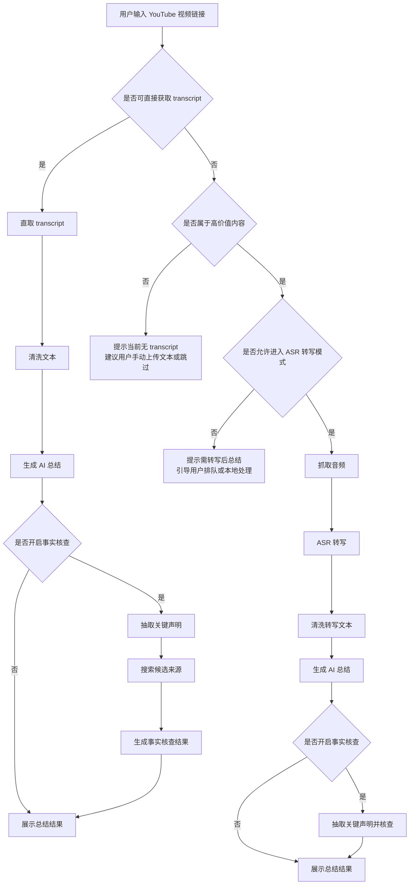

# YouTubeSummarizer 产品策略与 Transcript 双路径方案

## 1. 文档目标

这份文档用于回答 4 个核心问题：

1. 当前产品到底解决什么问题。
2. 目标受众是谁，不是谁。
3. `有 transcript` 与 `无 transcript` 两种视频应该如何走不同链路。
4. 后续版本应该优先做什么，避免产品边界失控。

---

## 2. 一句话定位

**YouTubeSummarizer 不是“全量 YouTube 视频总结器”，而是“面向资讯、知识、访谈类内容的 YouTube 快速理解工具”。**

当前最强的价值点不是“什么视频都能做”，而是：

- 对 **有 transcript 的信息型视频**，可以快速生成总结。
- 对重点内容，可以进一步做 **新闻事实核查**。
- 对 **无 transcript** 的视频，后续通过 ASR 转写做兜底，但不应默认全量开启。

---

## 3. 当前产品价值

### 3.1 用户价值

- 帮用户在看视频前先知道“它在讲什么”。
- 帮用户快速提炼重点、观点、争议点、事实声明。
- 帮用户判断内容值不值得完整观看。
- 对资讯、时政、科技、访谈类内容，进一步给出候选来源与事实核查结果。

### 3.2 当前已经跑通的能力

- YouTube transcript 直取。
- transcript 文本清洗与 AI 总结。
- 扩展一键总结 -> 主站接收 -> 自动填充 -> 自动总结。
- 事实核查候选搜索与来源链接展示。
- Bridge 服务作为主站与扩展间的桥接通路。

---

## 4. 目标受众

### 4.1 核心受众

- 海外资讯跟踪用户
- 时政、财经、科技内容重度消费者
- 研究型用户
- 学习型用户
- 内容运营、情报整理、竞品分析人员

这些用户有一个共同特征：

- **他们不是单纯想“看视频”，而是想“快速理解视频内容”。**

### 4.2 次级受众

- 英语听力一般，但阅读速度更快的用户
- 播客、访谈、课程类内容的高频学习者
- 希望把视频快速转成可搜索文本的人

### 4.3 非核心受众

下面这类内容不是当前 MVP 的主战场：

- 音乐 MV
- 游戏直播
- 强娱乐向 vlog
- 强剪辑、弱语音信息密度视频
- 纯视觉内容
- 短视频和大量 Shorts

原因很简单：

- transcript 价值低
- 总结价值弱
- 事实核查意义小
- 用户付费意愿通常更低

---

## 5. 市场覆盖判断

### 5.1 关于“有 transcript 的视频有多少”

YouTube 没有公开一个可信、统一的全平台 transcript 覆盖率数字。

目前可确认的事实只有：

- YouTube 对部分支持语言的视频会自动生成字幕。
- 自动字幕不是所有视频都稳定可用。
- 语言、音质、视频类型、时长、创作者设置等都会影响可用性。

因此，产品上不应追求“全平台精确比例”，而应使用 **场景覆盖率** 思维。

### 5.2 实用估算

从产品角度，可先按下面区间理解：

- **全量 YouTube 视频池**
  - 可直接拿到较可用 transcript 的比例：约 `35% ~ 60%`
- **资讯 / 教育 / 科技 / 访谈 / 评论 / 播客 / 长视频知识内容**
  - 可直接拿到较可用 transcript 的比例：约 `55% ~ 80%`
- **娱乐 / 混语言 / 口音重 / 音质差 / 直播切片 / Shorts**
  - 覆盖率会显著下降

这意味着：

- 当前产品覆盖不了整个 YouTube。
- 但对 **高信息密度视频**，已经足够构成一个成立的 MVP。

---

## 6. 双路径产品方案

## 6.1 核心原则

- **默认优先 transcript**：最快、最便宜、成功率最高。
- **无 transcript 时不直接放弃**：但也不默认全量跑 ASR。
- **对高价值内容做兜底**：只对值得处理的视频启用更重的链路。

## 6.2 流程图

## 6.3 两条路径的产品定义

### 路径 A：有 transcript

定位：**极速模式**

特点：

- 响应快
- 成本低
- 成功率高
- 适合作为默认主链路

适用场景：

- 新闻评论
- 播客访谈
- 科技解读
- 教育课程
- 讲话类视频

### 路径 B：无 transcript

定位：**转写兜底模式**

特点：

- 覆盖率更高
- 成本更高
- 响应更慢
- 错误率更高

适用场景：

- 高价值长视频
- 确有总结需求但 transcript 缺失
- 用户明确愿意等待

不建议默认开启的原因：

- yt-dlp 或音频获取容易失败
- 成本高
- 时间长
- 用户等待感强

---

## 7. 无 Transcript 视频的处理策略

## 7.1 不推荐的做法

不要一上来把所有无 transcript 视频都自动拉进 ASR。

这样会同时带来：

- 成本激增
- 总结等待时间变长
- 抓音频失败率上升
- 人机验证、版权和风控问题增加
- 用户体验不稳定

## 7.2 推荐的分层策略

### 第一层：直接总结

条件：

- transcript 可取

处理：

- 直接生成总结和事实核查

### 第二层：提示转写

条件：

- transcript 不可取
- 视频可能有价值

处理：

- 提示用户该视频需要转写后才能继续
- 告知预估耗时

### 第三层：异步 ASR

条件：

- 用户确认继续
- 视频属于高价值内容

处理：

- 后台跑音频提取
- 后台跑 ASR 转写
- 完成后再生成总结

### 第四层：本地转写

条件：

- 服务端抓取不稳定
- 视频较长
- 用户本地环境可用

处理：

- 通过本地 CLI / 小助手处理转写
- 服务端只负责总结与展示

---

## 8. 推荐的产品模式设计

### 模式 1：极速总结

- 只走 transcript 直取
- 定位为默认模式
- 优势是快、稳、便宜

适合做：

- 免费版
- 默认按钮
- 扩展一键总结

### 模式 2：兼容总结

- transcript 不可用时，允许自动转写
- 需要更长等待时间

适合做：

- 高级功能
- 会员功能
- 手动触发选项

### 模式 3：本地增强

- 通过本地 CLI / 小助手做音频转写
- 适合重度用户

适合做：

- 隐私敏感场景
- 超长视频
- 高失败率内容

---

## 9. 版本路线建议

## V1：把 transcript 主链路做深

目标：

- 稳定跑通扩展 -> bridge -> 主站 -> 总结 -> 核查
- 提高 transcript 获取成功率
- 优化总结页和事实核查页的可读性

重点：

- 稳定性
- 速度
- 来源链接质量

## V2：引入无 transcript 兜底

目标：

- 支持“转写后总结”

重点：

- 音频抓取成功率
- ASR 成本控制
- 异步任务体验

## V3：内容价值判断

目标：

- 不是所有无 transcript 视频都转写
- 只对高价值内容进入重链路

可参考信号：

- 视频时长
- 标题关键词
- 频道类型
- 用户是否主动请求深入处理

## V4：会员与分层

目标：

- 让高价值用户为更高覆盖率和更强处理能力付费

可分层为：

- 免费：有 transcript 的极速总结
- Pro：无 transcript 的异步转写总结
- 本地增强：CLI / 桌面助手

---

## 10. 核心指标建议

上线后至少要观察这些指标：

### 覆盖类

- transcript 直取成功率
- 无 transcript 视频占比
- ASR 兜底触发率

### 体验类

- 从输入链接到得到结果的平均耗时
- 事实核查生成成功率
- 用户二次使用率

### 商业类

- 每类视频的平均处理成本
- 高价值用户转化率
- 付费功能使用率

### 质量类

- transcript 文本可用率
- 总结满意度
- 事实核查引用链接点击率

---

## 11. 风险点

### 技术风险

- YouTube transcript 可用性不稳定
- yt-dlp/抓音频可能触发风控或失效
- ASR 成本与时延较高

### 产品风险

- 如果定位成“全量 YouTube 总结器”，用户预期会过高
- 如果无 transcript 视频处理体验太差，用户会误判产品不可用

### 应对策略

- 明确区分“可直接总结”和“需转写后总结”
- 明确提示预计耗时
- 保留失败回退与本地处理入口

---

## 12. 最终建议

当前阶段最合理的产品策略是：

1. **把“有 transcript 的信息型视频”做成一条又快又稳的主链路。**
2. **把“无 transcript”定义成下一阶段的高价值兜底能力，而不是默认主路径。**
3. **对外表达上，不强调“全 YouTube 覆盖”，强调“高信息密度视频的快速理解与核查”。**

换句话说：

**先做深，不要先做宽。**

这条路线更稳，也更容易从 MVP 长成可持续产品。
